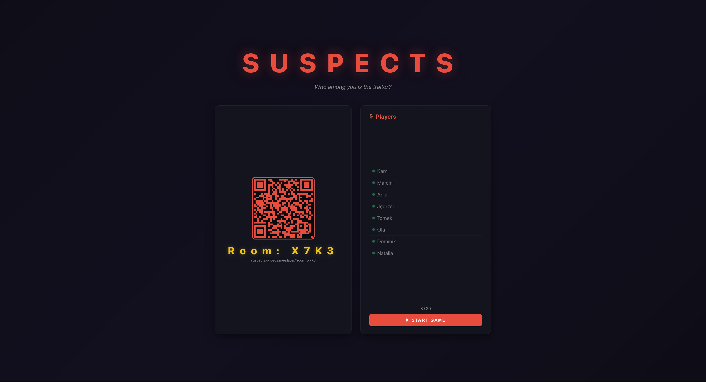
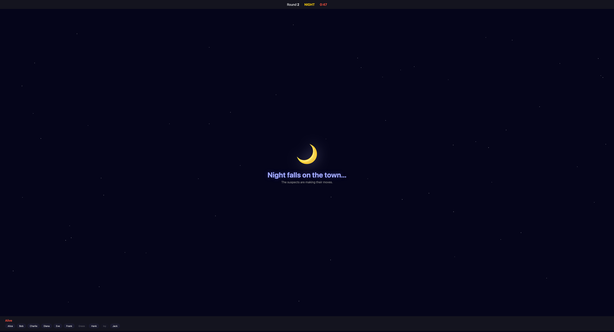
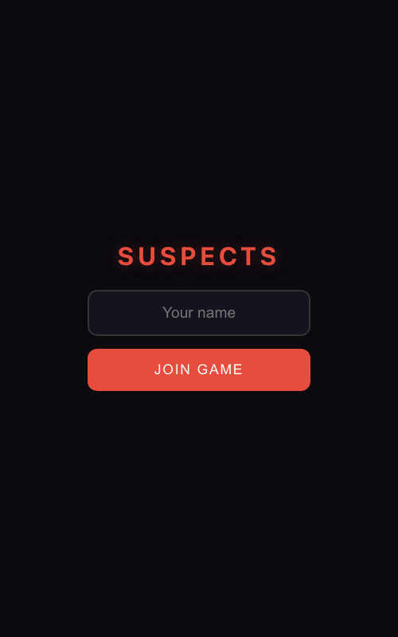
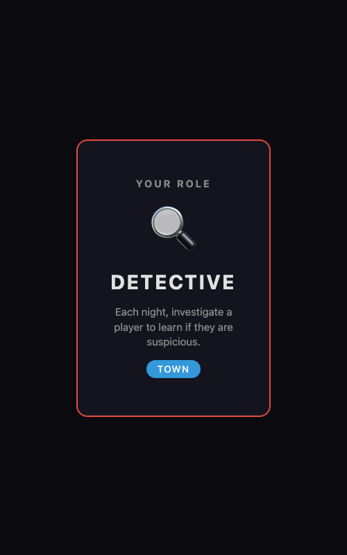

# 🎭 Suspects

**A multiplayer Mafia-style party game — powered by deception, psychology, and social deduction.**

One screen (TV or computer) displays the main game board. Players join from their phones by scanning a QR code. No app install required.

## Screenshots

<p align="center">
  
  <br><em>Host lobby — create a room, share the QR code</em>
</p>

<p align="center">
  
  <br><em>Night phase — atmospheric view with stars, moon, and alive player tracker</em>
</p>

<p align="center">
  
  &nbsp;&nbsp;&nbsp;
  
  <br><em>Player screens — join on your phone, receive your secret role</em>
</p>

## Features

- **6–30 players** — scales from small gatherings to large parties
- **16 unique roles** across three factions, dynamically assigned based on player count
- **Psychological mini-games** — Prisoner's Dilemma, Trust Circle, Alibi Challenge, Interrogation, Secret Vote
- **Night-phase resolution** with blocking, healing, investigation, and role-cleaning mechanics
- **Internationalization** — English, Polish, German, Czech, Kazakh (EN / PL / DE / CS / KK)
- **Real-time communication** via WebSocket between host screen and player devices

## Tech Stack

| Layer | Technology |
|-------|------------|
| Backend | Rust, [Axum](https://github.com/tokio-rs/axum) (with WebSocket support) |
| Database | SQLite via [SQLx](https://github.com/launchbadge/sqlx) |
| Frontend | HTML / JavaScript / CSS (served as static files) |
| Async runtime | [Tokio](https://tokio.rs) |

## Getting Started

### Prerequisites

- [Rust](https://rustup.rs/) (edition 2024)
- SQLite

### Build

```bash
cargo build --release
```

### Run

```bash
./target/release/suspects
```

The server starts on `0.0.0.0:8080` by default.

### Environment Variables

| Variable | Default | Description |
|----------|---------|-------------|
| `SUSPECTS_HOST` | `0.0.0.0` | Bind address |
| `SUSPECTS_PORT` | `8080` | Listen port |
| `DATABASE_URL` | `sqlite:suspects.db?mode=rwc` | SQLite connection string |
| `SUSPECTS_BASE_URL` | `http://localhost:8080` | Public URL shown in QR codes |

### Tests

```bash
cargo test
```

## Roles

Roles are assigned dynamically — more players unlock more complex roles.

### 🏘️ Town

| Role | Ability |
|------|---------|
| Civilian | No special ability — relies on discussion and voting |
| Doctor | Heals one player each night, protecting them from death |
| Detective | Investigates one player each night to learn their alignment |
| Escort | Blocks a player's night action |
| Vigilante | Can kill one player at night (unlocked at 15+ players) |
| Mayor | Town leader with no night action (unlocked at 20+ players) |
| Spy | Gathers intelligence on Mafia activity (unlocked at 25+ players) |

### 🔪 Mafia

| Role | Ability |
|------|---------|
| Mafioso | Votes with the Mafia to select a kill target each night |
| Godfather | Leads the Mafia; appears innocent to investigation (unlocked at 12+ players) |
| Consort | Mafia role-blocker (unlocked at 20+ players) |
| Janitor | Cleans a kill — the victim's role is hidden from Town (unlocked at 25+ players) |

### 🃏 Neutral

| Role | Ability |
|------|---------|
| Jester | Wins by getting voted out during the day (unlocked at 12+ players) |
| Survivor | Wins by staying alive until the end (unlocked at 15+ players) |
| Serial Killer | Independent killer; immune to Mafia attacks (unlocked at 20+ players) |
| Executioner | Wins by getting a specific target voted out (unlocked at 25+ players) |
| Witch | Redirects players' night actions (unlocked at 28+ players) |

## Project Structure

```
suspects/
├── src/
│   ├── main.rs            # Entry point
│   ├── config.rs          # Environment-based configuration
│   ├── db.rs              # Database setup and queries
│   ├── game/
│   │   ├── roles.rs       # Role & faction definitions
│   │   ├── scaling.rs     # Dynamic role assignment (6–30 players)
│   │   ├── phases.rs      # Night-phase action resolution
│   │   ├── minigames.rs   # Psychological mini-game types
│   │   ├── state.rs       # Game state management
│   │   └── win.rs         # Win condition evaluation
│   ├── rooms/             # Room/lobby management
│   └── ws/                # WebSocket handlers
├── static/
│   ├── host/              # Host screen UI
│   ├── player/            # Player phone UI
│   ├── shared/            # Shared assets
│   └── i18n/              # Translation files
├── migrations/            # SQLite migrations
└── tests/                 # Integration tests
```

## License

[MIT](LICENSE)
